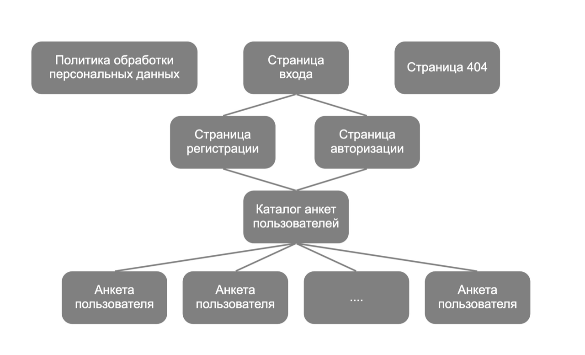
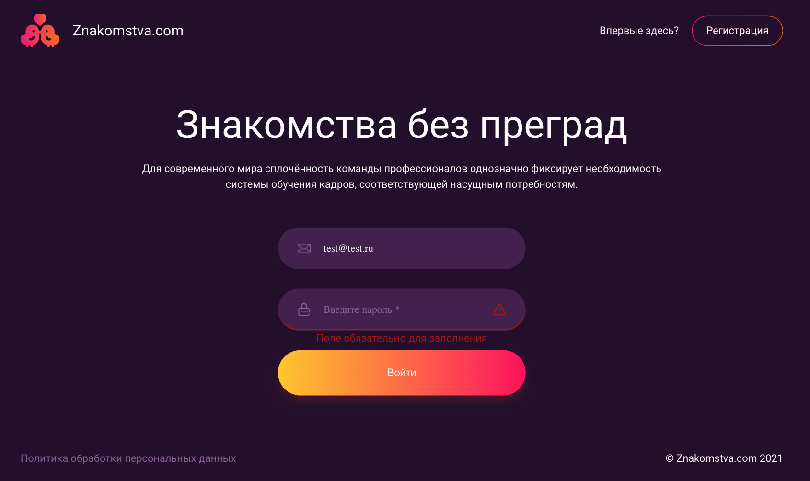
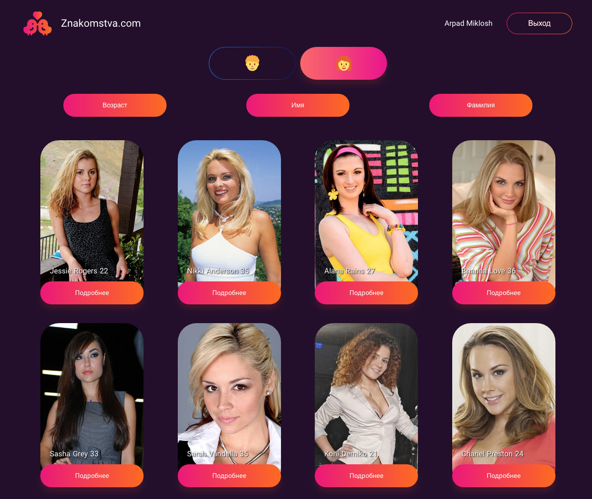
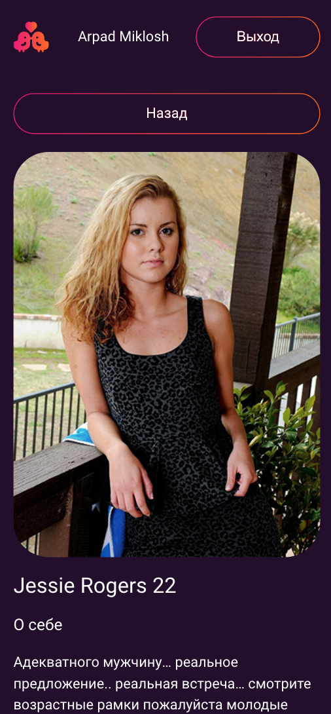

#  Сайт знакомств Znakomstva.com
SPA на React с использованием Redux, React Router, React Hooks. Верстка Mobile First под телефоны и десктопы.

## Архитектура проекта

## Основной функционал сайта

### Header:
Header для не авторизованных пользователей.
Header для авторизованных пользователей содержит имя текущего пользователя и кнопку выхода из аккаунта (удаление ключа авторизации, редирект на страницу авторизации).

### Страница входа:
Валидация формы, сверка логина и пароля с базой из JSON файла.

### Страница регистрации:
Валидация формы. При успешной регистрации сохранение данных пользователя в localStorage.

### Страница каталога анкет:
Вывод анкет пользователей на основе данных из локального файла JSON.
Выбор пола выводимых анкет.
Сортировка по возрасту, имени и фамилии.
Дочерний роутинг (переход на страницу с анкетой с передачей параметра роута).

### Страница анкеты:
Вывод фотографии и данных анкеты на основе локального файла JSON.

> PS: новый функционал дописывается по мере появления идей для реализации.

## Скриншоты страниц:

